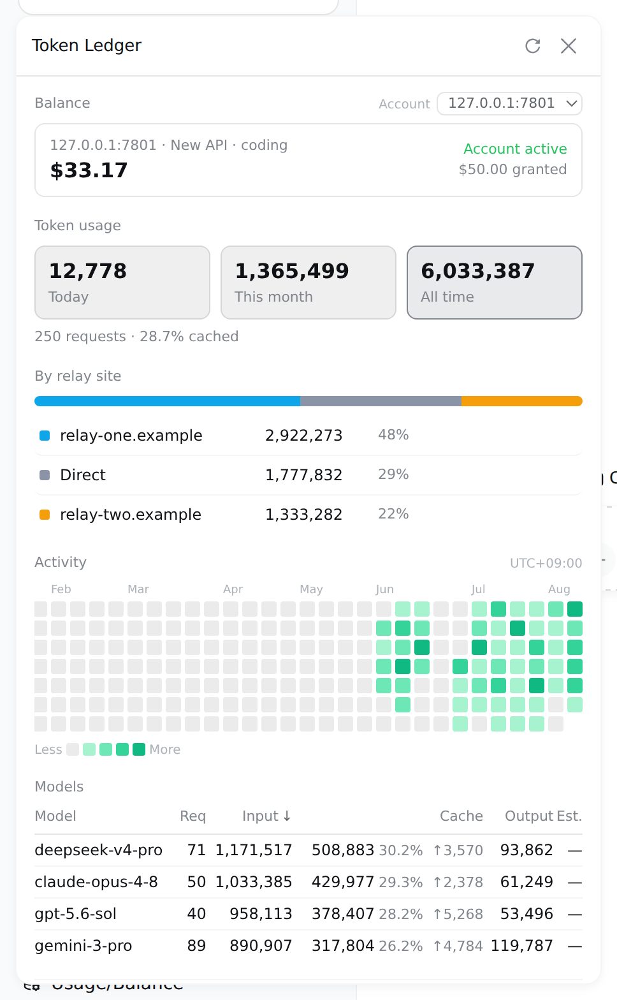

# TokenLedger（维护分叉 / Maintained fork）

[](LICENSE)
[](https://github.com/deepseek-ai/deepseek-harness)
[](https://github.com/zh667/TokenLedger)

把 [DeepSeek Harness](https://github.com/deepseek-ai/deepseek-harness) 的 Token 用量算清楚，并归属到**实际服务这次请求的中转站**——不用配置，不用凭据。

Token-usage accounting for the DeepSeek Harness Web GUI (`dsh web`), attributed
to the relay site that served each request. Zero configuration.



> 展示图使用演示数据与本机模拟中转站；面板上的每个数字都由真实代码路径算出，只是数据是造的。插件不会把 API Key 或上游原始响应发送到浏览器。

> ⚠️ **这不是上游仓库。** 本仓库是 [zh667/TokenLedger](https://github.com/zh667/TokenLedger)（`dsh-tokenledger@0.1.0`，MIT）的**维护分叉 v0.1.1**。上游 0.1.0 在 2026-08-28 之后的 DeepSeek Harness 上会**统计面板全空**（会话持久化 API 已换代，详见 [zh667/TokenLedger#61](https://github.com/zh667/TokenLedger/issues/61)）；本分叉修复了该兼容性断裂，并补齐了默认官方定价与紧凑单位展示。安装请使用本仓库地址：
>
> ```bash
> dsh plugin --profile web add "github:wangk123/dsh-tokenledger"
> ```

## 快速安装 / Quick start

需要 DeepSeek Harness `web` profile（`@deepseek-ai/dsh >= 0.1.0-rc.6`）与 Node.js ≥ 22。

```bash
dsh plugin --profile web add "github:wangk123/dsh-tokenledger"
```

重启已经在跑的 `dsh web`，浏览器硬刷新。侧边栏底部会出现「用量账本」入口。

> 首次启动扫描会回填**全部**历史会话（所有项目、所有会话日志），需要几秒到几十秒；期间面板先显示空值，扫描完成即自动出数。之后每 60 秒增量扫描一次，且只在日志有变化时触达磁盘。

升级或卸载：

```bash
dsh plugin --profile web update dsh-tokenledger
dsh plugin --profile web remove dsh-tokenledger
```

装完即可用：没有要填的配置，也不需要任何凭据就能看到全部用量与中转站分布。余额是唯一用到 key 的地方，而那把 key 宿主已经替你存着了。

## 一眼看懂 / At a glance

| | 能力 | 说明 |
| --- | --- | --- |
| 🎯 | **中转站归属** | 按 provider 的 `baseURL` 归一化 origin 分组——同一站的多把 key 合成一行，站名就是域名，不是你自己起的路由别名 |
| 🔍 | **零配置发现** | 从宿主的 provider 配置里读出中转站，不用你再填一遍。只读 `baseURL`，绝不碰旁边的凭据 |
| 💳 | **余额** | DeepSeek 官方、New API、Sub2API，每个账户一把普通 key 即可；不限额度的 key 报"已用"而不是假余额 |
| 📊 | **用量分析** | 今日/本月/累计三窗口、按站点/模型下钻、缓存命中率、一年活跃度热力图（悬停看当天模型构成） |
| 🧮 | **费用估算** | 未配置费率表时按 **DeepSeek 官方人民币价（峰时）自动兜底**；生效日期分段、分桶计价、峰谷窗口；未定价的模型显示破折号而不是 0 |
| 💰 | **今日一键看** | 侧边栏徽章直接显示「今日总 token · 今日消耗金额」，与面板选中范围无关 |
| 🔤 | **紧凑单位** | `1,325,296,850` → `1.33B`：徽章、三窗口卡片、站点/模型行、热力图全部用 `B / M / K` 展示 |
| 🗂 | **导出与诊断** | CSV / JSON 导出，索引健康度，归因不上的行数单独列出 |
| 🔒 | **只读回环** | 两个端点仅接受回环 GET，且在 peer socket 地址上设防；从不读取提示词、工具参数或响应内容 |

## 分叉变更 / Fork changes（对比上游 0.1.0）

| 变更 | 说明 |
| --- | --- |
| 🔧 **会话持久化 API 修复** | Harness 2026-08-28 起把 `sessionPersistence` 换成了 handle-based 模型（commit `bec6805d6a`），`listSnapshots()` / `readFrom(id, seq)` 已从源码删除。上游每次扫描第一步就抛 `TypeError`，异常被静默吞掉 → 面板永远为空。本分叉改走 `list()` / `open(id, "read")` → `read(offset)` → `close()`，同时保留旧接口回退分支，老宿主照常可用。 |
| 🔢 **seq 重编号兜底** | 会话 v1→v2 格式迁移会把事件 `seq` **重新编号**，旧 checkpoint 里的 `consumedSeq` 直接续读会越过整个日志、静默漏计。本分叉在 revision 变化时从 0 全量重折叠——`commitSession` 按会话整表替换 rollup 行，重折叠幂等，不会重复计数。 |
| 💰 **官方 ¥ 价目表兜底** | 未配置 `rates` 时自动按 DeepSeek 官方人民币价（峰时档）计价，并**按生效日分档**保留历史价格（[定价页](https://api-docs.deepseek.com/zh-cn/quick_start/pricing/)，2026-09-10 抓取）：**V4.1 Flash**（`deepseek-flash`，含旧名 `deepseek-v4-flash`、`-vision-exp` 与预览别名 `deepseek-v4.1-flash-expires-on-0910`）2026-09-10 起 ¥0.04/M 命中、¥2/M 未命中、¥8/M 输出；**V4 Pro** ¥0.30/M、¥9/M、¥27/M，2026-09-14 起随下线改按 Flash 价计。徽章显示「今日总 token · 今日金额」，面板用量详情的金额列与汇总同时生效；非 DeepSeek 模型保持「—」不瞎算。配置了 `rates` 时**永远优先**你的价目表。 |
| 🔤 **Token 单位紧凑化** | 徽章、三窗口卡片、站点/模型行、活跃度热力图全部改用 `1.33B / 27.69M / 862.4K`，超大数字不再溢出（悬浮提示仍显示完整数字）。 |

## 命令 / Commands

面板能回答的问题，命令行都能回答——两边读的是同一批查询，不存在第二套聚合。

```bash
/tokenledger                      # 全部时间
/tokenledger 7                    # 最近 7 天
/tokenledger 30 api.example.com   # 某个中转站，最近 30 天

/tokenledger site                 # 列出发现到的中转站
/tokenledger site add <路由名> <地址>
/tokenledger site rm <路由名>

/tokenledger export csv 30        # 导出
/tokenledger diagnostics          # 索引健康度
/tokenledger reindex              # 丢弃索引，从头重建
```

## 支持的账户类型 / Providers

| Provider | 模式 | 凭据 | 上游接口 |
| --- | --- | --- | --- |
| DeepSeek 官方 | 余额 | provider 的 `apiKeyEnv` | `/user/balance` |
| New API 系（含 One API、VoAPI 等分支） | 额度 | provider 的 `apiKeyEnv` | `/api/usage/token/` + `/api/status` |
| Sub2API | 余额 | provider 的 `apiKeyEnv` | `/v1/usage` |

三者都只需要一把**普通 API key**——就是你已经配给那条路由、用来发请求的那把。中转站跑的是哪套程序由路由指纹自动判定，在你第一次查它余额时探测一次并记住。

New API 的额度是**按 key** 的：同一个站上两把 key 是两份额度，面板分别列出。

## 配置 / Configuration

**通常不需要任何配置。** 中转站从宿主的 provider 设置里读出来；费用按官方价自动估算。

需要覆盖时，写进你已有的 `settings.yaml`（改完热更新，不用重启）：

```yaml
tokenledger:
  # 只在自动发现看不到时才需要——比如组合里没挂 settings 服务，
  # 或 provider 是 agent preset 在 agent.cordis.yml 里挂的
  relays:
    my-route: https://relay.example.com/v1

  # 费率表，用于费用估算。不配时按 DeepSeek 官方人民币价（峰时）兜底；
  # 配了就完全以这份为准（每个桶、每个模型、每个生效日单独定价）
  rates: []

  # 探测中转站跑的是哪套程序。默认关闭，第一次查余额时会自动探一次
  fingerprint: false
```

## 正确性与数据口径 / Correctness

用量折叠有三个地方容易错：

**请求失败了照样扣费。** 用量除了挂在 `assistant/message` 上，也会从 `assistant/chunk` 的 `{type:'usage'}` 流出。请求在报出 usage 之后失败，就永远等不到 `assistant/message`——但供应商已经收钱了。只订阅 `assistant/message` 会系统性少算这部分。

**同一个 `(turn, step)` 会被报告两次。** 后来的样本是**替换**前一个，不是累加；替换时必须从**原先归属的那一天和那条路由**里减回去。

**孤儿 usage chunk 不带身份。** `assistant/message` 自带 provider 和 model，`StreamChunk` 的 usage 变体没有。失败请求那条记录要回退到最近一次 `request/header`，且要认得 `reason: 'resume'`（进程重启会重发 header，那不是换模型）。归不上的记为显式 `unknown`，绝不猜。

口径上：`inputTokens`、`cacheReadTokens`、`cacheWriteTokens` 三个桶**互斥**，相加才是计费输入；`reasoningTokens` 是 `outputTokens` 的**子集**，只做展示，加进总数就是重复计费。天按**宿主进程的本地时间**切分，面板上会标出是哪个时区。

归属在**折叠时**写死进记录，历史永不重写。中转站集合发生变化时会丢弃索引并全量重建——否则新认出的站会显示成"你刚开始用它"。

> 折叠语义的完整测试在上游仓库；本仓库的 `test/` 覆盖扫描兼容层（见「开发」）。

## 隐私与安全 / Privacy & security

- **从不读取内容。** 只有计数和标识符：token 数、模型名、provider 路由名、站点域名。提示词、工具参数、响应正文既不读也不存。
- **凭据只在宿主侧。** key 由宿主的 credentials 服务按引用（`apiKeyEnv`）在请求时解析、用完即弃，始终走 `Authorization` 头，绝不进 URL 查询串。浏览器永远拿不到 key。
- **回环防护。** 两个 HTTP 端点注册为 exact 路由，因此位于 RPC 信任边界**之外**，处理器自己设防：拒绝非 GET，并同时校验 **peer socket 地址**（不可伪造）与 Host 头。
- **中转站指纹识别不用凭据**，靠路由的 404/401 特征。

## API

浏览器面板读这两个端点，仅限回环 GET：

| 端点 | 说明 |
| --- | --- |
| `GET /api/tokenledger/usage?days=&site=` | 整个面板的数据：三窗口合计、今日消耗金额、按天/模型/站点、一年活跃度与逐日模型构成、账户列表、索引诊断 |
| `GET /api/tokenledger/balance?account=` | 某个账户的余额 |

包也可作为库使用，供 DSH 之外的消费者：

```js
import { foldUsage, bySite, byModel } from "dsh-tokenledger";
import { LedgerStore } from "dsh-tokenledger/store";
import { readBalance } from "dsh-tokenledger/balance";
```

## 开发 / Development

```bash
npm test          # node --test：扫描兼容层 4 项测试
npm pack --dry-run
```

`test/sweep-handle-api.test.js` 覆盖的分叉核心行为：走新句柄 API 折叠用量、revision 未变时零读取跳过、v2 重编号后从 0 全量重折叠不重复计数、旧 `readFrom` 接口的回退分支。

浏览器半边**没有构建步骤**：它是一个手写的 `__ModuleLoader__` bundle，React 由宿主作为 peer 提供，样式手写注入。因此它能在 Node 里被加载和测试。

## 致谢 / Credits

- 上游项目：[zh667/TokenLedger](https://github.com/zh667/TokenLedger)（MIT）
- 热力图的分位数分级与悬停详情参考 [`xiufengsun/TokenTracker`](https://github.com/xiufengsun/TokenTracker)（MIT）
- New API 的计费口径读自 [`QuantumNous/new-api`](https://github.com/QuantumNous/new-api) 源码

> ⚠️ **非官方声明**：TokenLedger 是独立的第三方社区项目，与 DeepSeek 无隶属、赞助或背书关系。「DeepSeek」及相关商标归其权利人所有。

## 变更记录 / Changelog

### 0.1.2（2026-09-10）

- 新增：跟随 DeepSeek 2026-09-10 的模型改名与调价——`deepseek-flash`（V4.1 Flash）¥0.04/¥2/¥8（命中/未命中/输出，峰时），旧名 `deepseek-v4-flash`、`deepseek-v4-flash-vision-exp` 自该日起按 Flash 计价，预览别名 `deepseek-v4.1-flash-expires-on-0910` 按 V4.1 Flash 计价
- 新增：V4 Pro 2026-09-14 下线后的计价切换（当日 12:00 起官方路由到 V4.1 Flash 并按 Flash 价计费；价表按天粒度，09-14 全天按 Flash 价，属轻微低估而非高估）
- 修复：价表改为**按生效日分档**，历史用量继续按当时价格计算，不再用新价重算旧账

### 0.1.1（2026-09-08）

- 修复：`sessionPersistence` 句柄化后的 API 兼容（`list()` / `open(id,"read")` / `read(offset)`，含旧接口回退）——上游 v0.1.0 在 2026-08-28 之后的 Harness 上扫描全静默失败，面板为空（[zh667/TokenLedger#61](https://github.com/zh667/TokenLedger/issues/61)）
- 修复：v1→v2 会话迁移重编号 `seq` 后，revision 变化时从 0 全量重折叠，杜绝续读漏计
- 新增：内置 DeepSeek 官方人民币价目表（峰时，2026-09-01 起生效）作为默认计费；未配置 `rates` 时徽章显示「今日 token · 今日金额」，面板用量详情显示逐模型金额与汇总
- 新增：全面板 token 紧凑单位（`B / M / K`）

## License

[MIT](LICENSE)
